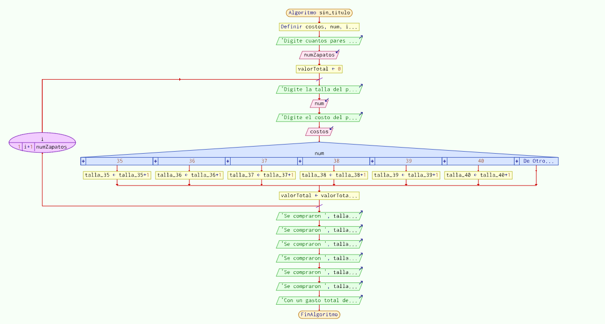
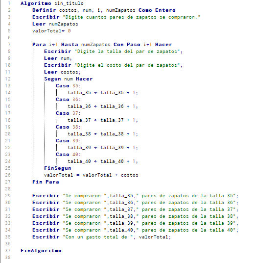

# Basic Inventory For a Shoe Store

PROJECT TITLE: Shoe Story

AUTHOR: Erick Daniel Florez Quintero

## Introduction

**I received a message for a job which says:**

- In his role as a software programmer, he has been chosen for the development of an application needed by the shoe store manager, which allows inputting expenses while restocking products. The program should be able to enter costs for each shoe size ranging from size 35 to 40, which is the most popular size nowadays. Additionally, the application should display a message indicating the total expenditure.

## User story

In this case, the Jira page was used to create the user story.

## Use case

**Name:** Shoe story | **Actors:** Software engineer | **Purpose:** Store the number of shoes, shoe size, and shoe cost to calculate the total expenses. |

Normal course of events:

1. The boss enters the number of pairs acquired.
2. The boss enters the number of pairs purchased.
3. The size number of each shoe is being added.
4. The boss enters the cost of each pair of shoes.
5. The number of shoes acquired per size is calculated, and the total expenses are calculated.
6. Everything is displayed on the screen.

## Flowchart

PSeInt was used for the creation of the flowchart.

## Pseudocode

PSeInt was used for the creation of the pseudocode.

